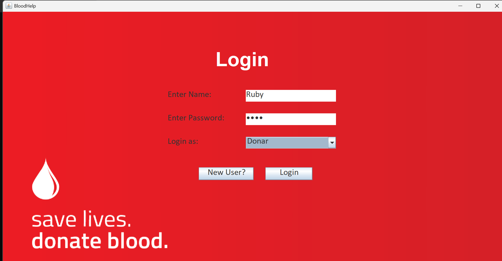
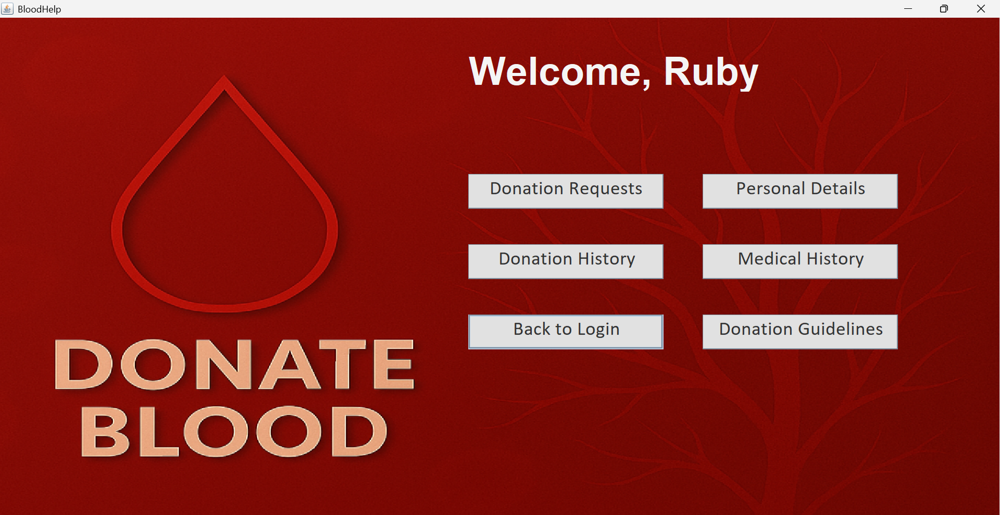
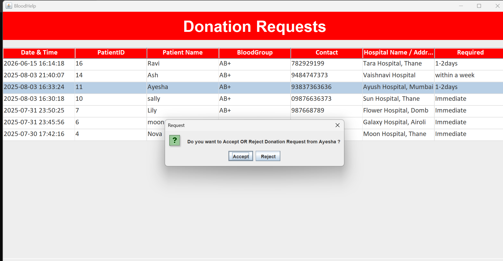
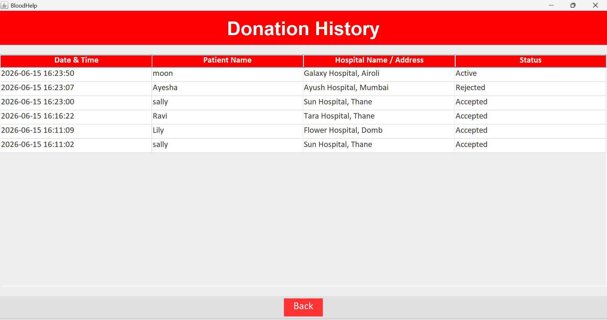
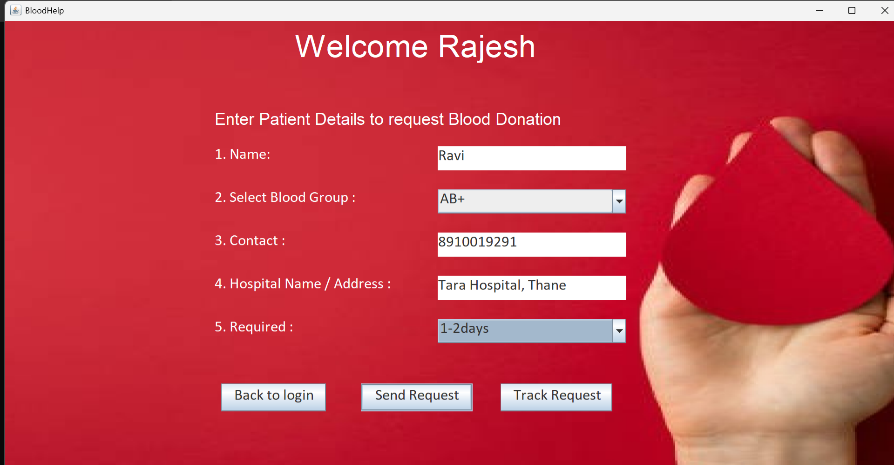
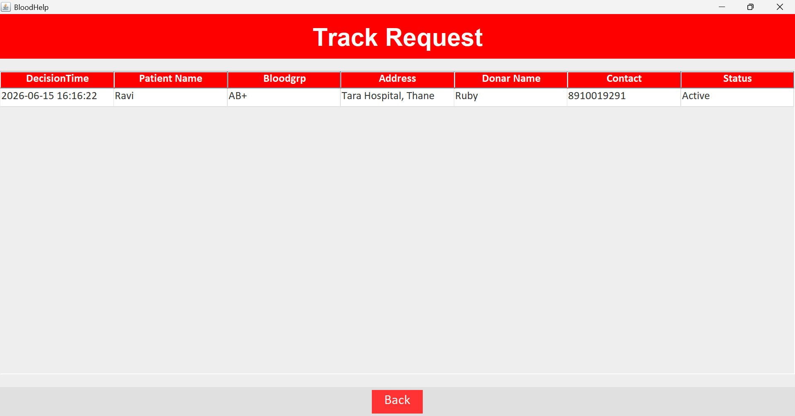

# 🩸 BloodHelp – Blood Bank Management System

BloodHelp is a Java and MySQL based desktop application designed to streamline blood donation management by connecting Eligible Donors with Patients, Tracking Donation Requests, and automating Blood group based matching.

---

## 🚀 Features

👤 **User Roles**  
- Donors: Accept/Reject Blood Requests based on availability.  
- Receivers: Request blood and Track Request Status.

🧪 **Medical Eligibility**  
- Donor eligibility based on criteria like weight, illness, diabetes, tattoos, etc.

🩸 **Blood Group Matching**  
- Requests go only to Matching Bloodgroup donors (e.g., O+ patient Blood requests → O+ donors only).

📋 **Donation Management**  
- Donor can only be active for one patient at a time.  
- All decisions are tracked with timestamps.

📊 **Request History**  
- Both donor and patient can track past and current interactions.

🖱️ **Interactive UI**  
- Built with Java Swing (`JTable`, `JOptionPane`)  
- Row-click enables Donor to Accept/Reject Request.

---

## 🛠️ Tech Stack

| Layer        | Technology Used               |
|--------------|-------------------------------|
| Language     | Java                          |
| UI Framework | Java Swing                    |
| Data Structures | `List<Integer>`, ArrayList, Arrays, Loops |
| Database     | MySQL                         |
| SQL Features | `SELECT`, `INSERT`, `UPDATE`, `DELETE`, `JOINs` |

---

## 🗃️ Database Tables Overview

### `users`  
Stores all donor and receiver user details.  
`userID | name | email | phone | city | area | dob | gender | password`

### `donarMedHist`  
Stores donor's health info to check eligibility.  
`userID | above50kg | diabetes | illness | tattoos | bloodgrp | eligible`

### `patient`  
Blood requests raised by receivers.  
`patientID | pname | bloodgrp | contact | address | required | requestTime | receiverID`

### `donarDecision`  
Tracks donor decisions on each request.  
`decisionID | userID | patientID | patientName | patientAddress | status | decisionTime`

---

## System Flow Diagram
```text
  Receiver Creates Blood Request for Patients
         ↓
  Request stored in Patient Table
         ↓
  Blood Group Matching
         ↓
  Eligible Donors
         ↓
  Accept / Reject
         ↓
  Decision History
```

---

## Screenshots & Demo video

### 1. Login page


### 2. Donar Dashboard


### 3. Blood Donation Requests


### 4. Blood Donation History


### 5. Receiver Dashboard


### Track Blood Requests


---

## ⚙️ How to Run

1. **Clone the Repository**
   ```bash
   git clone https://github.com/your-username/BloodHelp.git
   cd BloodHelp
   ```

2. **Set Up MySQL Database**
   - Create a DB named `bloodHelp`.
   - Import `.sql` schema with the tables above.
   - Update database credentials in your Java files.

3. **Launch the App**
   - Open the project in **IntelliJ** or **Eclipse**.
   - Run `Main.java` to start the GUI.

---

## 📌 Future Improvements
  - Admin dashboard for full monitoring.
 
---

## 🙋‍♀️ Developed By

**Deeksha Shetty**  
> Developed as a personal project to explore desktop application development, database design, and healthcare workflow automation.
